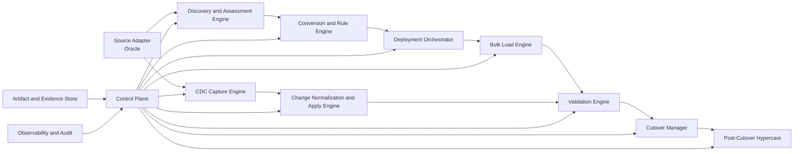

# Synqora End-to-End Migration Framework Architecture

## 1. Purpose

This document defines a production-grade architecture for `Synqora`, an end-to-end Oracle-to-PostgreSQL migration automation platform that can also support:

- one-time migrations
- migration with CDC until cutover
- continuous replication / synchronization
- on-premises, cloud, and hybrid topologies

The framework is designed to automate as much of the migration lifecycle as possible while still giving migration engineers clear visibility, control, evidence, and recovery options.

## 2. Product Goal

Provide a single control plane that can:

- connect to source Oracle systems and PostgreSQL targets
- assess migration complexity and risk
- convert schema, code, security, and operational objects
- deploy converted artifacts in dependency-safe waves
- perform bulk load with restartability
- run CDC / continuous replication until cutover
- validate schema, code, and data correctness
- orchestrate cutover and post-cutover stabilization

## 3. Core Design Principles

1. Read-first, automate-second
- discovery and validation must be trustworthy before automated changes are allowed

2. Evidence over assumptions
- every recommendation, failure, and conversion decision must be traceable to source evidence

3. Restartable by default
- every stage must support checkpoints, resume, and partial rerun

4. Adapter-driven
- source and target specifics belong behind connectors, not in the orchestration core

5. Rules plus assisted intelligence
- deterministic rules first, AI-assisted enhancement second

6. Safe for enterprise migration programs
- approval gates, audit history, environment promotion, and rollback awareness are mandatory

## 4. Scope

### In Scope

- Oracle source assessment
- PostgreSQL target preparation
- schema conversion
- procedural code conversion assistance
- users, roles, grants, and security mapping
- bulk data load
- CDC / replication orchestration
- validation and reconciliation
- cutover workflow orchestration
- observability, logging, and reporting

### Out of Scope for First MVP

- automatic application code refactoring
- full business-process testing
- cross-vendor BI/reporting rewrite
- complete autonomous self-healing without operator review

## 5. Product Modes

The platform should support these operating modes:

1. `Assessment Only`
- connect, inventory, score, and report

2. `Migration Factory`
- assess, convert, deploy, load, validate

3. `Migration + CDC`
- do full load, then continuous change capture until cutover

4. `Continuous Replication`
- ongoing source-to-target synchronization for DR, reporting, or staged modernization

## 6. High-Level Architecture

## 7. Platform Planes

### 7.1 Control Plane

Responsible for orchestration and governance.

Responsibilities:

- project and environment management
- run scheduling and execution control
- approvals and gates
- checkpointing and restartability
- issue tracking and lifecycle state
- cutover state machine
- dashboard and API access

### 7.2 Data Plane

Responsible for movement and synchronization of data.

Responsibilities:

- extraction
- chunking
- parallel loading
- LOB-aware handling
- CDC ingestion
- change application
- lag measurement
- retry and resume

### 7.3 Rule Plane

Responsible for deterministic migration knowledge.

Responsibilities:

- datatype mapping rules
- object conversion rules
- unsupported-pattern detection
- severity scoring
- auto-fix templates
- target-specific policy rules

### 7.4 Evidence Plane

Responsible for traceability.

Responsibilities:

- raw discovery snapshots
- generated artifacts
- validation results
- diffs
- logs
- metrics
- report history

## 8. Major Modules

## 8.1 Connection and Secret Manager

Responsibilities:

- manage source and target connections
- support on-prem, cloud, and hybrid networking
- store credentials securely
- rotate secrets where required
- validate privileges before runs

Needs:

- secret provider abstraction
- network profile abstraction
- least-privilege role validation

## 8.2 Discovery Engine

Responsibilities:

- inventory schemas, tables, views, packages, procedures, functions, triggers, indexes, sequences
- inventory users, roles, grants, synonyms, jobs, DB links, external dependencies
- inventory partitions, tablespaces, LOB usage, data volumes, row counts
- build object dependency graph
- capture representative metadata snapshots

Outputs:

- source inventory snapshot
- dependency graph
- unsupported feature list
- object complexity classification

## 8.3 Assessment Engine

Responsibilities:

- migration readiness scoring
- risk detection
- code conversion effort estimation
- data movement effort estimation
- cutover window estimation
- target sizing guidance
- replication feasibility checks

Assessment categories:

- schema risk
- semantic risk
- code portability risk
- data risk
- performance risk
- operational risk
- security risk
- cutover risk

Outputs:

- executive assessment
- detailed issue catalog
- weekly delivery planning report
- migration complexity score

## 8.4 Conversion Engine

Responsibilities:

- convert DDL
- map datatypes
- rewrite indexes and constraints
- convert or flag users, roles, and grants
- produce code conversion candidates
- enhance generated code using rules and assisted intelligence
- identify manual-conversion hotspots

Conversion classes:

- `Auto`
- `Auto with enhancement`
- `Manual review required`
- `Unsupported`

Outputs:

- target DDL packages
- code conversion packages
- security mapping packages
- conversion warnings

## 8.5 Deployment Orchestrator

Responsibilities:

- create dependency-aware deployment plans
- split deployment into phases
- track pre-data and post-data objects
- support parallel deployment where safe
- continue on error with issue capture
- support dry runs

Deployment waves:

1. target bootstrap
2. foundational schemas and roles
3. pre-data objects
4. data-load support objects
5. post-data objects
6. performance tuning objects
7. optional compatibility cleanup

## 8.6 Bulk Load Engine

Responsibilities:

- extract table data from source
- use smart chunking
- partition-aware extraction
- parallel load into PostgreSQL
- preserve restartability
- track row-level or batch-level failures
- optimize large-object handling

Capabilities:

- chunk by primary key or logical range
- adaptive parallelism
- per-table retry
- full-load performance metrics

## 8.7 CDC / Replication Engine

Responsibilities:

- capture source changes after snapshot
- normalize changes to a common internal format
- preserve transaction order where needed
- apply changes to PostgreSQL
- track lag and consistency
- support cutover-ready checkpoints

Core subcomponents:

- source log reader
- change normalizer
- transaction assembler
- conflict detector
- apply worker
- checkpoint store
- lag monitor

Supported strategies:

- log-based CDC
- query-based incremental fallback
- trigger-based fallback only if explicitly required

## 8.8 Validation Engine

Responsibilities:

- validate schema equivalence
- validate object deployment completeness
- validate converted code coverage
- validate row counts and sample hashes
- validate sequences and identities
- validate indexes and constraints
- validate business query outputs
- validate replication lag and apply consistency

Validation layers:

1. structural validation
2. semantic validation
3. data reconciliation
4. runtime validation
5. cutover readiness validation

## 8.9 Cutover Manager

Responsibilities:

- manage pre-cutover gates
- coordinate write freeze
- verify final CDC catch-up
- execute final validation
- switch application connectivity
- support rollback decision points
- record cutover evidence

Cutover states:

- planned
- precheck_running
- precheck_failed
- freeze_requested
- freeze_confirmed
- final_sync_running
- validation_running
- ready_to_switch
- switched
- rollback_in_progress
- completed

## 8.10 Hypercare and Stabilization

Responsibilities:

- run post-cutover smoke checks
- compare workload behavior
- monitor lag, locks, errors, and performance
- surface production issues quickly
- provide stabilization reports

## 8.11 Observability and Audit

Responsibilities:

- structured logs
- run-level metrics
- object-level progress
- replication lag metrics
- throughput metrics
- failure summaries
- audit events for approvals and changes

## 9. End-to-End Workflow

### Phase 1: Discover

- register project
- register source and target
- test connectivity
- capture source inventory
- capture target capabilities

### Phase 2: Assess

- run risk engine
- generate effort and complexity reports
- identify blockers
- approve migration plan

### Phase 3: Convert

- generate DDL and code artifacts
- apply enhancement rules
- produce review queue
- sign off converted packages

### Phase 4: Deploy Foundation

- deploy roles, schemas, extensions, baseline objects
- deploy pre-data objects
- validate readiness for load

### Phase 5: Full Load

- run chunked parallel load
- monitor load metrics
- retry failed chunks
- certify load completion

### Phase 6: Start CDC

- start change capture
- reconcile snapshot boundary
- track lag
- continuously apply changes

### Phase 7: Validate

- run schema checks
- run data reconciliation
- run code and object checks
- run performance and runtime checks

### Phase 8: Cutover

- freeze source writes
- drain CDC lag
- run final reconciliation
- switch applications
- monitor post-cutover health

### Phase 9: Hypercare

- validate stability
- triage issues
- finalize migration closure report

## 10. Logical Data Model

The platform itself needs a control database. Suggested core entities:

### 10.1 Project and Environment

- `migration_project`
- `environment`
- `connection_profile`
- `credential_reference`
- `run_window`

### 10.2 Discovery and Inventory

- `inventory_run`
- `inventory_object`
- `inventory_dependency`
- `inventory_statistic`
- `inventory_external_dependency`

### 10.3 Assessment and Issues

- `assessment_run`
- `assessment_issue`
- `assessment_recommendation`
- `risk_score`
- `effort_estimate`

### 10.4 Conversion

- `conversion_run`
- `conversion_artifact`
- `conversion_rule_hit`
- `manual_review_item`
- `autofix_suggestion`

### 10.5 Deployment

- `deployment_plan`
- `deployment_phase`
- `deployment_task`
- `deployment_result`
- `deployment_checkpoint`

### 10.6 Data Load

- `load_run`
- `load_table_run`
- `load_chunk`
- `load_failure`
- `load_checkpoint`

### 10.7 CDC / Replication

- `cdc_stream`
- `cdc_checkpoint`
- `cdc_batch`
- `cdc_lag_metric`
- `cdc_apply_error`
- `ddl_drift_event`

### 10.8 Validation

- `validation_run`
- `validation_check`
- `validation_result`
- `reconciliation_result`
- `sample_diff`

### 10.9 Cutover and Hypercare

- `cutover_run`
- `cutover_gate`
- `cutover_decision`
- `rollback_event`
- `hypercare_issue`

### 10.10 Audit and Observability

- `audit_event`
- `run_log`
- `metric_timeseries`
- `notification_event`

## 11. Suggested Table Shapes

### `migration_project`

- `project_id`
- `name`
- `source_engine`
- `target_engine`
- `mode`
- `status`
- `owner`
- `created_at`

### `assessment_issue`

- `issue_id`
- `project_id`
- `run_id`
- `object_type`
- `object_name`
- `severity`
- `confidence`
- `category`
- `evidence`
- `recommendation`
- `autofix_available`

### `conversion_artifact`

- `artifact_id`
- `project_id`
- `source_object_id`
- `artifact_type`
- `generated_sql`
- `generated_code`
- `quality_score`
- `review_state`
- `version_no`

### `load_chunk`

- `chunk_id`
- `load_run_id`
- `table_name`
- `chunk_key_start`
- `chunk_key_end`
- `status`
- `rows_loaded`
- `started_at`
- `finished_at`

### `cdc_stream`

- `stream_id`
- `project_id`
- `source_checkpoint`
- `target_checkpoint`
- `lag_seconds`
- `status`
- `last_success_at`

## 12. Service/API Design

The platform should expose stable APIs. Suggested groups:

### Project APIs

- `POST /api/projects`
- `GET /api/projects/{id}`
- `POST /api/projects/{id}/archive`

### Connection APIs

- `POST /api/connections/test`
- `POST /api/projects/{id}/connections/source`
- `POST /api/projects/{id}/connections/target`

### Discovery APIs

- `POST /api/projects/{id}/discovery/runs`
- `GET /api/projects/{id}/inventory`

### Assessment APIs

- `POST /api/projects/{id}/assessment/runs`
- `GET /api/projects/{id}/issues`
- `GET /api/projects/{id}/scores`

### Conversion APIs

- `POST /api/projects/{id}/conversion/runs`
- `GET /api/projects/{id}/artifacts`
- `POST /api/projects/{id}/artifacts/{artifact_id}/approve`

### Deployment APIs

- `POST /api/projects/{id}/deployment/plans`
- `POST /api/projects/{id}/deployment/runs`
- `POST /api/deployment/runs/{id}/resume`

### Load APIs

- `POST /api/projects/{id}/load/runs`
- `GET /api/load/runs/{id}/chunks`
- `POST /api/load/runs/{id}/retry-failures`

### CDC APIs

- `POST /api/projects/{id}/cdc/streams`
- `POST /api/cdc/streams/{id}/start`
- `POST /api/cdc/streams/{id}/stop`
- `GET /api/cdc/streams/{id}/lag`

### Validation APIs

- `POST /api/projects/{id}/validation/runs`
- `GET /api/validation/runs/{id}/results`

### Cutover APIs

- `POST /api/projects/{id}/cutover/runs`
- `POST /api/cutover/runs/{id}/advance`
- `POST /api/cutover/runs/{id}/rollback`

## 13. Rules Engine Design

The rules engine is central. A good rule record should include:

- `rule_id`
- `source_engine`
- `target_engine`
- `category`
- `object_type`
- `match_condition`
- `severity`
- `confidence`
- `rewrite_template`
- `validation_template`
- `autofix_template`

Rule families:

- datatype rules
- syntax rewrite rules
- procedural compatibility rules
- security mapping rules
- optimizer and performance rules
- data correctness rules
- CDC applicability rules
- validation rules

## 14. Conversion Quality Model

Every converted artifact should be scored:

- `Green`
  - deterministic and low-risk

- `Amber`
  - deployable but needs human review

- `Red`
  - unsupported or high-risk, manual rewrite required

Suggested artifact metrics:

- syntax confidence
- semantic confidence
- dependency completeness
- validation coverage
- runtime risk

## 15. Validation Framework

Validation should not stop at row counts.

### Structural Validation

- schemas
- tables
- columns
- datatypes
- defaults
- indexes
- constraints

### Semantic Validation

- null behavior
- date/timestamp behavior
- numeric precision
- sorting/collation behavior
- sequence/identity behavior

### Reconciliation

- row counts
- partition counts
- sample hashes
- aggregate totals
- duplicate detection

### Code Validation

- converted function/procedure compile state
- dependency resolution
- runtime smoke tests
- unsupported construct report

### Workload Validation

- top SQL plan comparison
- lock behavior review
- write-path tests
- CDC correctness checks

## 16. CDC / Replication Design Details

### Functional Requirements

- consistent snapshot boundary
- ordered change application
- checkpoint persistence
- restartable apply
- lag visibility
- table-level resync
- DDL drift detection

### Internal Flow

1. capture source changes
2. normalize into internal change events
3. group by transaction or safe apply unit
4. transform identifiers and types
5. apply to target
6. checkpoint after durable success

### CDC Risks to Design For

- tables without reliable keys
- out-of-order transactions
- source DDL during replication
- unsupported source object behavior
- long-running transactions
- LOB-heavy changes

## 17. Deployment and Cutover Safety

### Must-Have Safety Controls

- dry-run mode
- checkpoint and resume
- approval gates
- blast-radius labeling
- immutable artifact versions
- rollback playbook attachment
- final sync readiness gate

### Cutover Gate Examples

- zero critical open issues
- final CDC lag below threshold
- all validation gates green
- fallback plan approved
- hypercare team ready

## 18. Security and Governance

The platform must support:

- least-privilege connection profiles
- secret vault integration
- masked evidence for sensitive data
- audit trail for every operator action
- environment separation
- approval workflows for production
- retention controls for migration artifacts

## 19. UI / Dashboard Areas

Suggested product UI sections:

1. `Portfolio Dashboard`
- projects, statuses, risk heatmap

2. `Project Overview`
- source, target, mode, complexity, progress

3. `Assessment`
- issues, scores, effort, blockers

4. `Conversion Workbench`
- generated artifacts, review queue, red/amber/green status

5. `Deployment`
- plan graph, phase execution, failures, retries

6. `Data Load`
- throughput, chunk map, failures, restart points

7. `CDC / Replication`
- lag, stream health, apply errors, checkpoint state

8. `Validation`
- schema, code, data, reconciliation, performance

9. `Cutover Control`
- gate status, approvals, freeze, switch, rollback

10. `Hypercare`
- post-cutover issues, drift, performance, closure status

## 20. Deployment Topologies

The architecture should work for:

- source on-prem -> target on-prem
- source on-prem -> target cloud PostgreSQL
- source cloud -> target cloud PostgreSQL
- hybrid network-restricted environments

Design implication:

- connectors and workers should be deployable near source or target
- control plane can remain centralized
- data plane agents may run in customer-managed environments

## 21. Suggested Tech Boundaries

Recommended split:

- `Control Plane`
  - APIs, metadata store, orchestration, UI

- `Worker Plane`
  - discovery worker
  - conversion worker
  - deployment worker
  - load worker
  - CDC worker
  - validation worker

- `Storage`
  - control metadata database
  - artifact object store
  - metrics/log backend

## 22. MVP vs Enterprise Roadmap

### MVP

- Oracle source inventory
- PostgreSQL target inventory
- assessment and issue engine
- DDL conversion package generation
- deployment waves
- full-load engine with restartability
- basic CDC mode
- schema + row-count validation
- cutover checklist

### Phase 2

- procedural code enhancement
- richer reconciliation
- smarter parallelization
- dependency graph visualization
- object review workflow
- issue suppression and baselining

### Phase 3

- advanced CDC conflict handling
- workload replay support
- AI-assisted code remediation
- automatic fix suggestions
- policy-as-code gates
- multi-project portfolio governance

### Enterprise

- multi-tenant control plane
- agent deployment model
- approval chains
- customer-specific rule packs
- advanced compliance features
- managed hypercare workflows

## 23. Suggested Build Sequence

### Track 1: Foundation

- project model
- connection model
- run orchestration
- artifact store
- issue store

### Track 2: Assessment

- discovery adapters
- dependency graph
- migration scoring
- issue engine

### Track 3: Conversion

- DDL conversion pipeline
- rule engine
- artifact review model

### Track 4: Deployment and Load

- deployment planner
- execution engine
- load workers
- checkpoints

### Track 5: CDC and Validation

- CDC abstraction
- apply engine
- validation framework
- reconciliation engine

### Track 6: Cutover and Hypercare

- cutover state machine
- final gate automation
- post-cutover dashboard

## 24. Key Risks if We Do Not Design Them Early

- migration succeeds technically but fails operationally
- converted code is accepted without runtime proof
- CDC is added too late and cannot support real cutover windows
- artifact lineage is weak, making enterprise sign-off difficult
- rollback is undefined
- target-cloud differences are not modeled
- project state becomes spreadsheet-driven outside the platform

## 25. Recommended Next Deliverables

1. domain model and database schema for the control plane
2. service boundaries and API contract draft
3. source adapter contract for Oracle
4. PostgreSQL target adapter contract
5. migration run state machine
6. CDC checkpoint model
7. validation catalog
8. UI wireframe for assessment, execution, and cutover

## 26. Summary

The right mental model for `Synqora` is not just "a migration tool."

It is a `migration operating system` with:

- a control plane for orchestration
- a data plane for load and replication
- a rule plane for conversion intelligence
- an evidence plane for trust, validation, and sign-off

If built this way, the same framework can support:

- assessment-only engagements
- one-time Oracle-to-PostgreSQL migration
- migration with CDC until cutover
- long-running replication and synchronization programs
