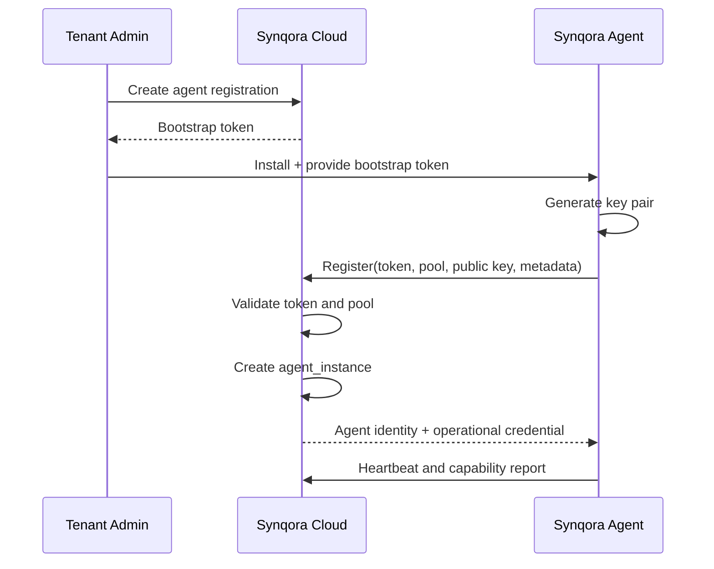

# Synqora Agent Registration and Trust Model

## 1. Purpose

This document defines how a customer-side `Synqora Agent`:

- enrolls into `Synqora Cloud`
- establishes trust
- proves identity on every call
- is authorized to act on specific environments
- is rotated, revoked, quarantined, or retired safely

This model is designed for the SaaS-first `Synqora` architecture where:

- the control plane is hosted
- the agent runs in customer-managed infrastructure
- the agent initiates outbound connectivity
- database access happens only from the agent side

## 2. Design Goals

The trust model must provide:

- tenant-safe enrollment
- per-agent identity
- no long-lived shared passwords
- outbound-only registration and operations
- clean revocation and re-enrollment
- auditable lifecycle events
- environment-scoped authorization
- support for both standard SaaS and dedicated SaaS

## 3. Trust Model Principles

1. `Bootstrap trust` is temporary
- one-time or short-lived registration secrets are only for enrollment

2. `Operational trust` is durable but rotatable
- after enrollment, the agent should authenticate with stronger credentials than the bootstrap token

3. `Identity is per agent instance`
- each deployed runtime gets its own identity, not a shared team-wide credential

4. `Authorization is separate from identity`
- being a valid agent does not automatically mean it can access every environment

5. `The agent pulls work`
- the cloud does not require inbound access into customer networks

## 4. Core Security Objects

These map directly to the control-plane schema.

### `agent_pool`

Represents a logical execution group such as:

- `customer-prod-east`
- `onprem-primary-dc`
- `validation-workers`

Pools help route jobs and scope capabilities.

### `agent_registration`

Represents a bootstrap enrollment record.

Used for:

- issuing a short-lived registration token
- limiting who can enroll under a pool
- expiring unused bootstrap invitations

### `agent_instance`

Represents a registered runtime with a stable identity.

The agent instance is the real operational identity after enrollment.

### `agent_environment_binding`

Defines what an agent or pool is allowed to touch.

This is the primary authorization bridge between:

- agent identity
- project environments

## 5. Identity Primitives

Each agent should have these identity primitives:

### Bootstrap token

Used only for first enrollment.

Properties:

- short-lived
- hashed server-side
- single-use or limited-use
- scoped to one tenant and one pool

### Agent-generated key pair

Generated locally on the agent during bootstrap.

Properties:

- private key never leaves the agent
- public key or certificate signing request is sent to cloud

### Agent certificate or signed credential

Issued after successful bootstrap.

Recommended V1 approach:

- mTLS-capable client certificate or
- short-lived signed agent credential plus refresh flow

Preferred long-term direction:

- per-agent client certificate with rotation

### Agent instance ID

Stable UUID assigned by the control plane.

### Capability claims

Describe what the agent can do, for example:

- discovery
- conversion
- deployment
- bulk_load
- cdc_capture
- cdc_apply
- validation

## 6. Recommended Enrollment Flow

### 6.1 Operator preparation

1. tenant admin creates or selects an `agent_pool`
2. tenant admin requests an `agent_registration`
3. control plane issues a bootstrap token
4. operator installs `Synqora Agent` in customer environment

### 6.2 Agent bootstrap

1. agent starts with bootstrap token
2. agent generates a local key pair
3. agent establishes TLS to `Synqora Cloud`
4. agent sends:
   - bootstrap token
   - pool reference
   - public key or CSR
   - runtime metadata
   - capability summary

### 6.3 Cloud-side validation

1. verify token hash
2. verify token not expired
3. verify token not over-used
4. verify target tenant and pool
5. create `agent_instance`
6. issue operational credential

### 6.4 Activation

1. agent stores operational credential securely
2. agent transitions to `active`
3. agent begins heartbeat and job polling

## 7. Suggested Sequence

## 8. Authentication Model

## 8.1 Bootstrap Phase

Authentication factors:

- bootstrap token
- TLS channel

Bootstrap constraints:

- short expiry
- limited usage
- tenant-scoped
- pool-scoped

## 8.2 Operational Phase

Authentication should move to one of these:

### Preferred

- mutual TLS with agent-issued client certificate

### Acceptable V1

- signed agent access token obtained via bootstrap-issued refresh credential

For V1, the cleanest approach is:

- bootstrap token -> enroll
- cloud issues agent certificate or long-lived refresh handle
- agent uses short-lived access tokens for API calls

## 9. Authorization Model

Identity answers:

- who is this agent?

Authorization answers:

- what is this agent allowed to do?

The control plane should authorize using:

1. tenant scope
2. pool membership
3. agent status
4. environment bindings
5. capability requirements
6. project assignment rules

Examples:

- an agent may be valid but not allowed to touch production
- an agent may be allowed for Oracle source discovery but not for cutover tasks
- an agent may be allowed for one tenant only

## 10. Agent Status Lifecycle

Recommended `agent_instance.status` states:

- `pending_registration`
- `active`
- `draining`
- `offline`
- `unhealthy`
- `quarantined`
- `revoked`
- `retired`

### Meaning

- `active`
  - can poll and run work
- `draining`
  - can finish current jobs but should not receive new work
- `offline`
  - no recent heartbeat
- `unhealthy`
  - heartbeat exists but indicates a bad runtime state
- `quarantined`
  - cloud intentionally blocks it from work pending investigation
- `revoked`
  - trust invalidated, should not be accepted
- `retired`
  - intentionally removed from service

## 11. Registration Token Lifecycle

Recommended `agent_registration.status` states:

- `issued`
- `used`
- `expired`
- `revoked`

Rules:

- token is hashed at rest
- token cannot be recovered from the database
- token expiry should be short
- token should be pool-scoped
- token may optionally be single-use only for high-security tenants

## 12. Credential Rotation

The trust model must support:

- routine credential rotation
- forced rotation after suspicion or compromise
- seamless rollover without losing active jobs

Recommended rotation flow:

1. agent requests renewal before expiry
2. cloud validates current identity
3. cloud issues replacement credential
4. agent confirms activation
5. old credential is retired after grace window

## 13. Revocation and Quarantine

Revocation is needed when:

- token leaked
- host compromised
- agent drifted to an untrusted version
- tenant removes access

Control-plane actions:

- set `agent_instance.status = revoked` or `quarantined`
- stop new job leasing
- optionally cancel outstanding jobs
- emit audit events

Agent-side behavior:

- on auth rejection, stop polling
- surface clear operational error
- require re-enrollment or operator action

## 14. Environment Access Model

Use `agent_environment_binding` to scope access.

Bindings should support:

- pool-wide access to a source environment
- pool-wide access to a target environment
- one-off agent-specific exceptions
- read-only vs write-enabled modes

Recommended `access_mode` examples:

- `discover`
- `convert_assist`
- `deploy`
- `load`
- `cdc_capture`
- `cdc_apply`
- `validate`
- `cutover`

This becomes the authorization gate before any job is leased.

## 15. Secret Handling

The agent should not receive raw database passwords from the control plane unless explicitly needed.

Preferred secret patterns:

- agent resolves local secret reference
- customer secret manager integration
- ephemeral credential fetch

Recommended design:

- `connection_profile.secret_reference` points to a secret descriptor
- the agent knows how to resolve it in its own environment

Examples:

- local file mount
- Kubernetes secret
- cloud secret manager
- HashiCorp Vault

## 16. Audit Requirements

Every sensitive trust event should generate `audit_event` records:

- registration issued
- registration used
- agent enrolled
- agent credential rotated
- agent revoked
- agent quarantined
- environment binding changed
- pool assignment changed

## 17. Minimal Control-Plane APIs

These are conceptual high-level endpoints.

### Admin-side

- `POST /api/agent-pools`
- `POST /api/agent-registrations`
- `POST /api/agent-instances/{id}/drain`
- `POST /api/agent-instances/{id}/revoke`
- `POST /api/agent-instances/{id}/quarantine`

### Agent-side

- `POST /agent/register`
- `POST /agent/renew`
- `POST /agent/heartbeat`
- `GET /agent/config`

## 18. Failure Scenarios to Design For

### Bootstrap token leaked

Mitigation:

- short expiration
- one-time usage
- revoke registration record

### Agent host compromised

Mitigation:

- revoke credential
- quarantine instance
- require new enrollment

### Cloned VM or container image reused incorrectly

Mitigation:

- unique local keypair per runtime
- do not bake credentials into images

### Stale agent version

Mitigation:

- version policy in control plane
- optional denylist or minimum-supported version

## 19. Recommended V1 Choices

For V1, I recommend:

- bootstrap token enrollment
- agent-generated keypair
- outbound-only registration
- per-agent identity
- environment authorization via bindings
- certificate or signed-credential rotation support
- explicit agent states: active, draining, offline, revoked

## 20. Open Questions

1. mTLS in V1 or short-lived token plus TLS in V1?
2. do we support dedicated hardware or host attestation later?
3. how much local posture evidence do we require from agents?
4. should environment access be pool-only in V1, with per-agent exceptions later?

## 21. Summary

The right model for `Synqora Agent` trust is:

- temporary bootstrap trust
- durable per-agent identity
- outbound-only operational connectivity
- environment-scoped authorization
- explicit rotation and revocation

That gives `Synqora` a clean enterprise-friendly trust model without requiring unsafe inbound access from the SaaS control plane into customer networks.
