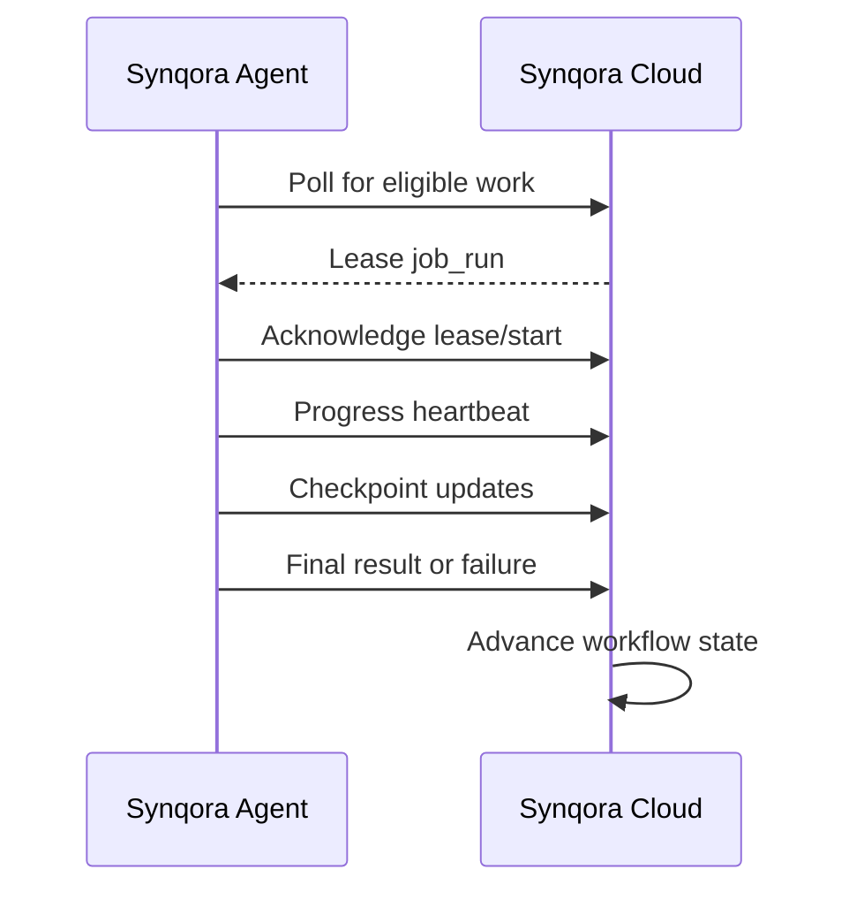

# Synqora Cloud-to-Agent Job Protocol

## 1. Purpose

This document defines the high-level job protocol between `Synqora Cloud` and a customer-side `Synqora Agent`.

It describes:

- how the control plane offers work
- how the agent leases and executes work
- how progress, checkpoints, logs, and results are reported
- how retries and cancellation work

This protocol is intended to sit on top of the agent trust model and the control-plane schema.

## 2. Goals

The protocol must support:

- pull-based execution
- resumable long-running work
- tenant-safe execution
- clear ownership of job state
- scalable multi-agent pools
- durable checkpoints
- auditable state transitions
- safe retries and cancellation

## 3. Protocol Principles

1. `Agents pull work`
- the control plane does not open inbound sessions into customer networks

2. `Leases, not blind dispatch`
- an agent leases a job for a bounded time window

3. `Checkpoint frequently`
- long-running jobs must persist restartable state

4. `State changes are explicit`
- job lifecycle transitions must be durable and auditable

5. `Payloads are versioned`
- job schemas must be stable and compatible across agent versions

## 4. Related Control-Plane Tables

This protocol maps directly to:

- `job_definition`
- `job_run`
- `job_checkpoint`
- `workflow_run`
- `workflow_step_run`
- `job_log_ref`
- `state_transition_event`
- `agent_instance`

## 5. Communication Model

Recommended default model:

- HTTPS over outbound TLS
- authenticated agent calls
- JSON payloads
- pull-based polling plus optional long-poll or streaming later

For V1:

- short polling is acceptable
- long-polling can be added later if needed

## 6. Job Lifecycle

Recommended `job_run.status` lifecycle:

- `queued`
- `leased`
- `running`
- `succeeded`
- `failed`
- `cancelled`
- `timed_out`

Meaning:

- `queued`
  - waiting to be leased
- `leased`
  - reserved for a specific agent for a limited duration
- `running`
  - actively executing
- `succeeded`
  - completed successfully
- `failed`
  - terminal failure after retry policy exhausted or non-retryable error
- `cancelled`
  - intentionally stopped by operator or workflow controller
- `timed_out`
  - lease expired or execution violated runtime limits

## 7. Sequence Overview



## 8. Job Assignment Model

The control plane should decide eligibility based on:

- tenant match
- agent status
- pool match
- environment authorization
- capability requirements
- version compatibility
- current workload and priority

An agent should only see jobs it is eligible to execute.

## 9. Core Protocol Operations

## 9.1 Poll for Work

Agent asks for work it can run.

Input signals:

- agent identity
- capabilities
- max concurrent job capacity
- current load
- optional preferred job categories

Possible outcomes:

- no work
- one job lease
- several leases if batching is allowed

## 9.2 Lease Job

The control plane assigns a job lease with:

- `job_run_id`
- `lease_expires_at`
- `payload_json`
- `job_definition` metadata
- optional artifact references

Lease guarantees:

- no second agent should get the same active lease unless the first lease expires or is revoked

## 9.3 Start Job

Agent confirms it is beginning execution.

This transitions:

- `leased -> running`

The agent may also refuse the lease if:

- local capability changed
- environment is not reachable
- configuration is invalid

## 9.4 Heartbeat / Progress

During execution, the agent should periodically send:

- current state
- percent progress if meaningful
- throughput metrics
- warning summary
- current checkpoint reference

## 9.5 Checkpoint

For restartable work, the agent should persist checkpoint data back to cloud.

Examples:

- last table completed
- last chunk completed
- source log position
- artifact phase boundary
- validation set position

## 9.6 Complete Job

On success, the agent submits:

- final status
- result summary
- output references
- metrics
- warnings

This transitions:

- `running -> succeeded`

## 9.7 Fail Job

On failure, the agent submits:

- error class
- retryable yes/no
- failure details
- latest checkpoint

The control plane then decides:

- retry same job
- mark failed
- escalate workflow

## 9.8 Cancel Job

Operator or workflow may cancel a running or queued job.

Agent behavior:

- poll or receive cancellation state on heartbeat response
- stop safely at checkpoint boundary where possible

## 10. Job Types

Recommended V1 `job_type` examples:

- `discover_source_inventory`
- `discover_target_inventory`
- `run_assessment_rules`
- `generate_conversion_artifacts`
- `deploy_pre_data_objects`
- `deploy_post_data_objects`
- `bulk_load_table_chunk`
- `start_cdc_stream`
- `apply_cdc_batch`
- `run_validation_check`
- `execute_cutover_step`

Each job type should have:

- versioned payload schema
- capability requirement
- retry policy
- timeout policy

## 11. Suggested Payload Envelope

High-level shape:

```json
{
  "job_run_id": "uuid",
  "job_type": "bulk_load_table_chunk",
  "job_version": "v1",
  "tenant_id": "uuid",
  "project_id": "uuid",
  "workflow_run_id": "uuid",
  "step_run_id": "uuid",
  "lease_expires_at": "2026-06-12T18:00:00Z",
  "capability_required": "bulk_load",
  "inputs": {},
  "artifact_refs": [],
  "checkpoint_resume_ref": null,
  "execution_policy": {
    "timeout_seconds": 3600,
    "max_attempts": 5
  }
}
```

## 12. Checkpoint Model

Checkpoint rules:

- checkpoint format must be job-type specific
- checkpoint writes must be idempotent
- checkpoints must be monotonic for ordered work where required
- a job retry should be able to resume from the latest durable checkpoint

Examples:

### Bulk load

- current table
- current chunk boundary
- rows loaded so far

### CDC

- source log position
- last applied batch sequence

### Validation

- completed checks
- last object processed

## 13. Retry Model

Retries must be policy-driven.

Recommended fields:

- `attempt_count`
- `max_attempts`
- `retry_policy_json`

Suggested retry classes:

- `transient`
  - network issue, temporary lock, temporary target unavailable
- `environmental`
  - secret unavailable, disk full, permission drift
- `logical_non_retryable`
  - malformed payload, unsupported object, deterministic code error

The agent reports whether the failure looks retryable, but the control plane makes the final retry decision.

## 14. Lease and Timeout Model

Each leased job should have:

- lease expiry
- heartbeat expectations
- optional max runtime

If heartbeats stop:

- job may remain `running` until grace threshold
- then transition to `timed_out` or be re-queued, depending on policy

Do not instantly requeue without considering duplicate execution risk.

## 15. Concurrency Rules

Agents may run multiple jobs if:

- capability allows it
- environment bindings allow it
- resource policy allows it

But some job categories should be serialized:

- cutover steps
- certain deployment phases
- ordered CDC apply streams

Concurrency should be governed by:

- agent pool policy
- job type policy
- environment-level mutual exclusion rules

## 16. Ordering Rules

Some jobs are independent.

Some jobs require strict order.

### Ordered examples

- deployment wave steps
- CDC apply in ordered streams
- cutover state transitions

### Unordered or parallel examples

- discovery on many schemas
- bulk load chunks
- many validation checks

The control plane must enforce ordering at workflow level, not by hoping agents behave correctly.

## 17. Result and Evidence Reporting

When jobs finish, they should report:

- status
- summary
- output references
- metrics
- warnings
- error details if any

Heavy outputs should be stored outside the metadata DB.

The control plane stores:

- metadata
- references
- summaries
- state transitions

## 18. Logging Model

V1 recommendation:

- agent keeps detailed local logs
- agent streams summarized log events and references
- control plane stores:
  - status summaries
  - error summaries
  - log references

This avoids turning the control-plane DB into a raw log sink.

## 19. Minimal API Surface

Conceptual agent-side endpoints:

- `POST /agent/jobs/poll`
- `POST /agent/jobs/{job_run_id}/start`
- `POST /agent/jobs/{job_run_id}/heartbeat`
- `POST /agent/jobs/{job_run_id}/checkpoint`
- `POST /agent/jobs/{job_run_id}/complete`
- `POST /agent/jobs/{job_run_id}/fail`

Conceptual admin/control endpoints:

- `POST /api/workflows/{workflow_run_id}/cancel`
- `POST /api/jobs/{job_run_id}/retry`
- `POST /api/jobs/{job_run_id}/reassign`

## 20. Security Considerations

The protocol must ensure:

- agent can only poll within its tenant scope
- job payloads are tenant-scoped
- environment references are authorization-checked
- leased jobs are bound to eligible agents
- artifacts are accessed with scoped references

Sensitive payloads should be minimized. Prefer references over raw secrets or large inline payloads.

## 21. Failure Scenarios to Design For

### Agent crashes mid-job

Expected behavior:

- heartbeat stops
- lease expires
- control plane decides whether to retry from checkpoint

### Duplicate execution risk

Mitigation:

- lease-based execution
- idempotent target operations where possible
- checkpoint-aware recovery

### Control-plane restart

Mitigation:

- job state is persisted in DB
- workflow state is reconstructable

### Network interruption

Mitigation:

- retry polling
- keep local work state until lease or policy dictates stop
- cloud uses grace windows before failover

## 22. Recommended V1 Protocol Profile

For V1, I recommend:

- pull-based polling
- single active lease ownership
- explicit `start`, `heartbeat`, `checkpoint`, `complete`, `fail`
- JSON payload envelopes
- checkpointed long-running jobs
- central retry decisioning
- ordered workflow orchestration in cloud

## 23. Open Questions

1. polling only in V1, or long-poll from day one?
2. can some low-risk jobs be batched in one lease?
3. should CDC apply be its own specialized stream protocol instead of normal job protocol later?
4. how much live log streaming do we need in the first release?

## 24. Summary

The right `Synqora` job protocol is:

- pull-based
- lease-driven
- checkpoint-aware
- explicitly stateful
- cloud-orchestrated and agent-executed

That gives the platform a reliable execution backbone for discovery, conversion, deployment, load, CDC, validation, and cutover without relying on brittle push-style execution into customer networks.
