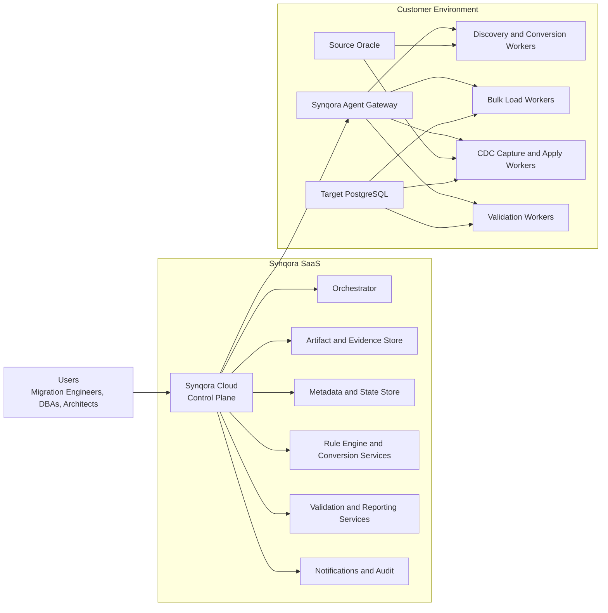

# Synqora SaaS Deployment Architecture

## 1. Purpose

This document defines a concrete SaaS-first deployment architecture for `Synqora`.

The goal is to make `Synqora` practical for enterprise Oracle-to-PostgreSQL migration programs where:

- the control plane is centrally hosted
- customer data sources may stay on-premises or in customer cloud accounts
- bulk load and CDC need to run close to the data
- security, auditability, and restartability are mandatory

This architecture assumes `Synqora` is not only a migration tool, but a long-running migration and replication platform.

## 2. Recommended Product Shape

`Synqora` should be deployed as:

1. `Synqora Cloud`
- multi-tenant SaaS control plane

2. `Synqora Agent`
- customer-managed worker runtime deployed near source and target systems

3. `Synqora CLI`
- automation and administrative entry point

4. `Synqora Rule Packs`
- versioned conversion, validation, and migration-risk knowledge bundles

## 3. Why SaaS-First Is the Right Model

### Better than a desktop-style workbench

A classic thick-client model makes collaboration, approvals, audit, and long-running CDC operations harder.

### Better fit for migration programs

Real migration programs need:

- shared projects
- centralized reports
- approvals and sign-off
- artifact history
- repeatable orchestration
- long-running replication tasks

### Better for CDC and cutover

CDC and cutover readiness are operational workflows, not just one-time conversion tasks. A SaaS control plane fits that much better than a local-only tool.

## 4. Deployment Model

### 4.1 High-Level Topology

### 4.2 Main Design Choice

The control plane is SaaS-hosted.

The data-plane workers are customer-side agents.

This avoids forcing database connectivity from the public SaaS plane directly into customer networks while still giving the customer a unified hosted experience.

## 5. Core Components

## 5.1 Synqora Cloud Control Plane

This is the hosted management layer.

Responsibilities:

- authentication and tenant management
- project and environment management
- orchestration and workflow state
- issue tracking
- conversion job coordination
- deployment planning
- validation result aggregation
- cutover state management
- reporting and dashboards
- audit logging

This layer should never need direct database connectivity to customer systems in the default model.

## 5.2 Synqora Agent

This is the customer-managed runtime.

Responsibilities:

- connect to source Oracle
- connect to target PostgreSQL
- run discovery jobs
- run conversion assistance tasks
- execute deployment steps
- run bulk-load tasks
- run CDC capture and apply
- perform validation and reconciliation
- stream job telemetry back to the control plane

The agent should be deployable in:

- Kubernetes
- VM
- Docker Compose
- isolated private networks

## 5.3 Synqora CLI

Responsibilities:

- bootstrap agents
- register environments
- run scripted project actions
- export reports
- support CI/CD or internal platform automation

## 5.4 Artifact and Evidence Store

Hosted in the SaaS plane.

Stores:

- discovery snapshots
- assessment reports
- converted artifacts
- rule-hit evidence
- validation outputs
- reconciliation results
- cutover records

Large raw extracts should not default to SaaS storage unless explicitly configured.

## 5.5 Metadata and State Store

Hosted in the SaaS plane.

Stores:

- tenants
- projects
- runs
- issue states
- approvals
- checkpoints
- replication status
- cutover state

## 5.6 Rule and Conversion Services

Hosted in the SaaS plane, but execution-aware.

Responsibilities:

- rule catalog management
- artifact scoring
- code enhancement suggestions
- validation templates
- migration-risk scoring

The heavy execution stays agent-side, while rules and orchestration remain centralized.

## 6. Control Plane vs Agent Responsibilities

## 6.1 Control Plane

Owns:

- tenant and user identity
- projects and workspaces
- workflow orchestration
- rule definitions
- report generation
- issue lifecycle
- approvals
- audit trail
- cutover gates

Does not directly own:

- persistent live access to source databases
- bulk extract data paths
- customer-side network routing

## 6.2 Agent Plane

Owns:

- secure database connectivity
- local extraction and loading
- CDC capture and apply
- execution of deployment steps
- local validation queries
- retries and resumable work
- secure outbound telemetry to Synqora Cloud

Does not own:

- tenant administration
- product-wide orchestration decisions
- shared rule-authoring lifecycle

## 7. Tenancy Model

Recommended default:

- multi-tenant SaaS control plane
- tenant-isolated metadata
- tenant-scoped artifact storage namespaces
- tenant-scoped encryption keys where required

### Enterprise upgrade path

Support:

- single-tenant dedicated SaaS environment
- private-region deployment
- private link / dedicated network path

## 8. Security Model

## 8.1 Connectivity Principle

All database access should originate from the `Synqora Agent`, not from the hosted control plane.

This gives customers:

- simpler firewall rules
- less concern about inbound connectivity
- better control over credentials and execution locality

## 8.2 Secrets

Secrets should be handled as:

- SaaS references only where possible
- customer-managed secret retrieval in the agent
- short-lived tokens for agent registration
- rotation support

## 8.3 Communication Direction

Preferred network posture:

- outbound TLS from agent to Synqora Cloud
- no inbound open port required from the internet into customer data centers by default

## 8.4 Data Sensitivity

By default, the SaaS plane should store:

- metadata
- evidence
- summaries
- validation results
- artifacts

But not:

- full source data copies
- full extracted LOB payloads
- unrestricted raw business data

unless the customer explicitly enables that mode.

## 9. Network Flow

## 9.1 Standard Flow

1. user signs into Synqora Cloud
2. user defines source and target environments
3. customer deploys Synqora Agent inside their network
4. agent registers with Synqora Cloud using a bootstrap token
5. control plane schedules work
6. agent pulls job instructions
7. agent runs database work locally
8. agent pushes logs, metrics, checkpoints, and results back

## 9.2 CDC Flow

1. control plane records the selected transport provider and consistency mode
2. agent validates source logging, privileges, retention, object keys, table size, and provider prerequisites
3. control plane creates a protocol contract: snapshot boundary, chunk manifest, CDC start checkpoint, validation gates, and cutover policy
4. agent or external provider captures the source checkpoint before full load
5. agent or external provider starts CDC capture from that checkpoint before or during full load
6. full load runs with the approved chunk plan and records per-chunk evidence
7. CDC applies changes after the captured boundary and publishes lag/checkpoint metrics
8. validation compares full-load chunks, CDC checkpoints, and business aggregates
9. control plane monitors readiness for cutover

## 9.3 Transport Provider Strategy

Synqora should not force one copy engine. The SaaS control plane should let customers choose the transport that fits their estate, licensing, cloud provider, and operations team:

- AWS DMS for AWS-native managed full-load and CDC
- Qlik Replicate or HVR for high-throughput enterprise heterogeneous replication
- Oracle GoldenGate for Oracle-heavy low-downtime migrations
- Debezium/Kafka Connect for open-source streaming pipelines
- ora2pg or pgloader for open-source controlled batch/schema migration
- customer-managed unload/load paths such as Data Pump, files, object storage, external tables, and PostgreSQL COPY

Synqora's responsibility is the consistency protocol around that transport: checkpoint capture, chunk manifest, provider task evidence, validation, lag thresholds, approval gates, and rollback readiness.

## 9.4 Consistency Modes

Synqora should expose three consistency modes:

| Mode | Customer Scenario | Product Behavior |
| --- | --- | --- |
| Global Snapshot Mode | Smaller or medium estates where one source checkpoint can cover all schemas | one SCN/checkpoint for the whole run, CDC starts after that boundary |
| Schema Wave Snapshot Mode | Large enterprise migrations by application, schema, or business wave | one checkpoint per dependency-aware wave with cross-wave validation |
| Table-Level Snapshot Mode | 5 TB+ tables, hot tables, or very long migrations | per-table/table-group checkpoints with stronger CDC and reconciliation gates |

Assessment must recommend the mode and explain risks such as `ORA-01555`, missing supplemental logging, insufficient archive retention, tables without primary keys, LOB-heavy change streams, and provider limitations.

## 10. Agent Footprint

The agent should be modular rather than monolithic.

Recommended internal services:

- `agent-gateway`
  - receives jobs and sends status
- `discovery-worker`
- `conversion-worker`
- `deployment-worker`
- `load-worker`
- `cdc-worker`
- `validation-worker`

These can run:

- in one pod for small projects
- as separate scalable workers for larger programs

## 11. Install Modes

## 11.1 SaaS Standard

- Synqora Cloud hosted by vendor
- customer deploys one or more Synqora Agents
- best default mode

## 11.2 SaaS Dedicated

- dedicated tenant stack
- customer-specific region or environment
- for stricter compliance or isolation

## 11.3 Private Control Plane

- same architecture pattern
- customer-hosted control plane plus agent plane
- reserved for heavily regulated customers

This should be a secondary offering, not the primary design center.

## 12. Scaling Model

## 12.1 Control Plane Scaling

Scale by:

- tenant-aware stateless API services
- background orchestration workers
- horizontally scalable report generation
- artifact storage offload

## 12.2 Agent Scaling

Scale by:

- more workers per environment
- parallel extract/load workers
- dedicated CDC workers
- separate validation workers

Bulk load and CDC should scale independently.

## 13. Execution Locality

Work should run close to the data whenever possible.

Examples:

- on-prem Oracle -> on-prem agent
- Oracle on EC2 -> agent in same VPC
- PostgreSQL target in cloud -> load/apply worker near target

For hybrid migrations, support split-worker designs:

- capture near source
- apply near target

## 14. Deployment Responsibility Matrix

| Component | Hosted by Synqora | Hosted by Customer |
|---|---|---|
| Web UI | Yes | No |
| API and orchestration | Yes | No |
| Metadata store | Yes | No |
| Rule catalog | Yes | No |
| Artifact store | Usually yes | Optional mirror |
| Source DB connectivity | No | Yes |
| Target DB connectivity | No | Yes |
| Bulk load execution | No | Yes |
| CDC capture/apply | No | Yes |
| Validation execution | No | Yes |

## 15. Operational Model

## 15.1 Project Lifecycle

- create project in SaaS UI
- bind source and target environments
- assign agent pools
- run discovery
- review issues
- run conversion
- deploy in waves
- full load
- start CDC
- validate
- cut over
- hypercare

## 15.2 Agent Lifecycle

- provision agent
- register to tenant
- health check
- receive jobs
- checkpoint work
- upgrade safely
- drain jobs for maintenance

## 16. Upgrade Strategy

### Control Plane

- rolling SaaS upgrades
- backward-compatible APIs
- feature flags by tenant

### Agents

- version compatibility matrix
- minimum supported control-plane protocol
- staged rollout by agent pool
- drain-and-upgrade for CDC workers

## 17. Observability Model

The SaaS plane should present:

- project-level dashboards
- agent health
- run health
- chunk/load throughput
- CDC lag
- validation completion
- cutover gate state

The agent should emit:

- structured logs
- progress events
- checkpoint events
- failure diagnostics
- resource metrics

## 18. Cutover Design in SaaS Mode

The control plane should own the cutover workflow, while the agent executes the final local steps.

### Control Plane responsibilities

- freeze checklist orchestration
- approval gates
- final validation aggregation
- cutover decision record

### Agent responsibilities

- final sync run
- last-mile validation
- environment-specific execution tasks
- post-switch verification

## 19. SaaS Product Boundaries

To avoid becoming a risky data custodian by default, `Synqora Cloud` should focus on:

- control
- evidence
- orchestration
- reporting

while `Synqora Agent` handles:

- direct data operations
- replication
- local execution

That is the cleanest enterprise-friendly split.

## 20. Comparison: SaaS vs Self-Hosted

| Dimension | SaaS-First Synqora | Full Self-Hosted |
|---|---|---|
| Time to adopt | Faster | Slower |
| Shared visibility | Strong | Customer-managed |
| Upgrades | Easier | Heavier |
| Enterprise control | Good with agents | Maximum |
| Operational burden | Lower for customer | Higher for customer |
| Best fit | Most customers | Strictly regulated environments |

## 21. Recommended First Release Shape

For V1, I recommend:

- multi-tenant SaaS control plane
- customer-deployed agent
- outbound-only agent registration model
- Oracle discovery support
- PostgreSQL target support
- full-load orchestration
- basic CDC orchestration
- assessment, validation, and cutover dashboards

## 22. Recommended Repository Follow-Ups

Next concrete design documents should define:

1. SaaS control-plane schema
2. agent registration and trust model
3. job protocol between control plane and agent
4. agent internal worker model
5. CDC checkpoint and resume model
6. artifact and evidence storage contract
7. multi-tenant authorization model
8. deployment topology for standard and dedicated SaaS

## 23. Summary

The recommended deployment model for `Synqora` is:

- `SaaS-hosted control plane`
- `customer-managed agent plane`
- `web-first collaboration`
- `CLI-assisted automation`
- `agent-executed data and CDC operations`

This gives `Synqora` the strengths of AWS-style migration architecture without inheriting the limitations of an old desktop-first installation model.
